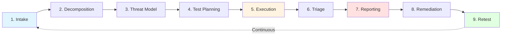
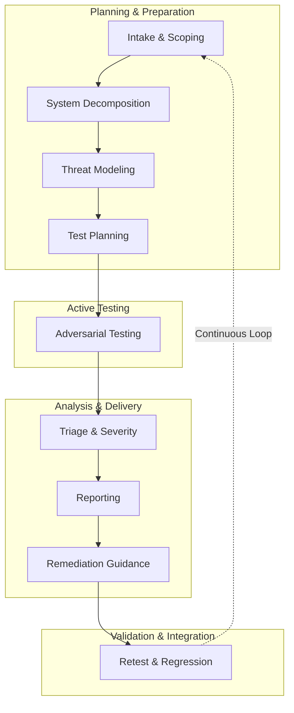

---
tags:
  - trust-boundary/data-knowledge
  - trust-boundary/deployment-governance
  - type/methodology
  - type/overview
---
# AI Red Teaming Lifecycle Overview

## Purpose

The AI red teaming lifecycle provides a systematic, repeatable framework for uncovering vulnerabilities before attackers do. Unlike ad-hoc testing, this structured approach ensures comprehensive coverage, reproducible evidence, and actionable remediation guidance.

Each phase produces documented outputs that become inputs for the next phase, creating a traceable chain from initial risk hypotheses through validated fixes.

---

## Why a Lifecycle Approach Matters

**Systematic vs Ad-Hoc:**
- Ad-hoc testing misses attack vectors, produces inconsistent evidence, and lacks clear remediation paths
- Lifecycle approach ensures no critical phase is skipped, findings are reproducible, and fixes are validated

**Phase Interdependencies:**
- Threat modeling without architecture review misses attack surfaces
- Testing without test planning yields scattered, low-value findings
- Reporting without remediation guidance wastes stakeholder time
- Fixes without retest leave uncertainty about effectiveness

**Continuous Improvement:**
- Findings feed into CI/CD regression tests
- Each engagement refines threat models and playbooks
- Metrics track vulnerability trends across model versions

---

## The 9-Phase Lifecycle

---

### Phase 1: Intake & Scoping

**Purpose:** Define assessment boundaries, objectives, and success criteria

**Key Activities:**
- Discovery call with stakeholders
- Threat actor profiling (capabilities, goals, access assumptions)
- Trust boundary mapping
- Scope negotiation (in-scope systems, exclusions, constraints)
- Access provisioning

**Outputs:**
- Signed scope document
- Threat model assumptions
- Access checklist
- Timeline and communication plan

**Duration:** 1-2 days

[[phase-1-intake-scoping|Detailed guidance →]]

---

### Phase 2: System Decomposition & Architecture Review

**Purpose:** Understand how the AI model integrates into its application context and map attack surfaces

**Key Activities:**
- Architecture review (data flows, tool integrations, authentication boundaries)
- Asset inventory (sensitive data, privileged tools, business logic)
- Trust boundary identification
- Defense mechanism documentation (prompt filters, sandboxing, monitoring)

**Outputs:**
- System architecture diagram with trust boundaries
- Asset inventory prioritized by business risk
- Defense mechanism catalog
- Attack surface map

**Duration:** 2-3 days

[[phase-2-system-decomposition|Detailed guidance →]]

---

### Phase 3: Threat Modeling

**Purpose:** Systematically identify attack vectors and prioritize based on business risk

**Key Activities:**
- Define attacker personas (external user, insider, supply chain attacker)
- Enumerate AI-specific threats (prompt injection, data poisoning, tool misuse, etc.)
- Map threats to trust boundaries
- Develop attack trees showing progression from initial access to impact
- Prioritize scenarios by likelihood and business consequence

**Outputs:**
- Threat model document with attack trees
- Prioritized attack scenario list
- Risk hypotheses for validation during testing
- Framework mapping (ATLAS tactics, OWASP categories)

**Duration:** 2-3 days

[[phase-3-threat-modeling|Detailed guidance →]]

---

### Phase 4: Test Planning & Coverage

**Purpose:** Map threat model to concrete, executable test cases

**Key Activities:**
- Define test objectives per attack scenario
- Select techniques from playbooks (OWASP Top 10, ATLAS techniques)
- Plan coverage (breadth vs depth trade-offs)
- Choose tooling per test type (manual, automated, hybrid)
- Define success criteria and evidence requirements

**Outputs:**
- Test plan with objectives → techniques → expected outcomes
- Coverage matrix (which threats are tested, which are out of scope)
- Tool selection and configuration plan
- Evidence capture checklist

**Duration:** 1-2 days

[[phase-4-test-planning|Detailed guidance →]]

---

### Phase 5: Execution (Adversarial Testing)

**Purpose:** Execute attacks and collect proof-of-concept evidence

**Key Activities:**
- Manual exploratory testing (human creativity and adaptation)
- Automated fuzzing and systematic probing (breadth and consistency)
- Real-time pivoting based on observed behaviors
- Evidence capture (prompts, outputs, logs, screenshots, configs)
- Safety harnesses for dangerous tests (especially agents)

**Outputs:**
- Raw findings with proof-of-concept evidence
- Attack transcripts and reproduction steps
- Configuration metadata (model version, temperature, seeds)
- Notes on unexpected behaviors for future threat modeling

**Duration:** 5-12 days (varies by engagement scope)

[[phase-5-execution|Detailed guidance →]]

---

### Phase 6: Triage & Severity Assessment

**Purpose:** Transform raw findings into validated, risk-prioritized vulnerabilities

**Key Activities:**
- Classify findings (confirmed vs hypothesis vs observation)
- Verify reproducibility with statistical thresholds
- Apply AI-specific severity scoring (exploitability, impact, scope, persistence, detectability)
- Root cause analysis
- Framework mapping (ATLAS IDs, OWASP categories, NIST RMF)

**Outputs:**
- Risk-prioritized findings list
- Severity ratings with justification
- Impact analysis per finding
- Framework compliance matrix

**Duration:** 1-2 days

[[phase-6-triage-severity|Detailed guidance →]]

---

### Phase 7: Reporting & Communication

**Purpose:** Deliver findings in formats suitable for technical and executive audiences

**Key Activities:**
- Write executive summary (business risk, strategic recommendations)
- Document technical findings (vulnerability descriptions, PoC evidence, root causes)
- Create remediation roadmap (phased: immediate → short-term → long-term)
- Package evidence (transcripts, logs, reproduction scripts)
- Present findings to customer security team

**Outputs:**
- Executive summary (5-10 pages)
- Technical findings report (30-50 pages)
- Framework compliance matrix
- Evidence package
- Remediation roadmap with effort estimates

**Duration:** 2-3 days

[[phase-7-reporting|Detailed guidance →]]

---

### Phase 8: Remediation Guidance

**Purpose:** Provide actionable mitigation advice mapped to root causes

**Key Activities:**
- Map fixes to vulnerability root causes
- Recommend controls per finding type (input validation, output sanitization, access controls, etc.)
- Prioritize remediations (critical immediate fixes vs long-term hardening)
- Define fix validation criteria
- Reference applicable frameworks (SAIF controls, NIST RMF mitigations)

**Outputs:**
- Control recommendations per finding
- Prioritized remediation plan
- Fix validation test cases
- References to defense-in-depth strategies

**Duration:** Integrated with Phase 7 reporting

[[phase-8-remediation-guidance|Detailed guidance →]]

---

### Phase 9: Retest & Regression Integration

**Purpose:** Validate fixes and integrate findings into continuous assurance

**Key Activities:**
- Re-execute original PoCs to confirm remediation
- Test for bypass variations
- Validate fixes don't break legitimate functionality
- Add findings to CI/CD regression test suites
- Build evaluation harnesses for continuous monitoring
- Track metrics over time (vulnerability trends, fix effectiveness)

**Outputs:**
- Retest validation letter (pass/fail per finding)
- Regression test suite additions
- Continuous monitoring configuration
- Lessons learned for future threat modeling

**Duration:** 3-5 days (post-remediation)

[[phase-9-retest-regression|Detailed guidance →]]

---

## Phase Dependencies

**Critical Path:**
- Phases 1-4 must be completed sequentially (each builds on previous outputs)
- Phase 5 can begin once Phase 4 is complete, but may inform Phase 4 refinements
- Phases 6-8 are tightly coupled (triage informs reporting, reporting includes remediation)
- Phase 9 occurs post-remediation and feeds back into future engagements

---

## Adapting the Lifecycle

### By Engagement Type

**Full-Spectrum Assessment:**
- All 9 phases executed thoroughly
- Breadth-first coverage across all trust boundaries
- Duration: 2-3 weeks

**Focused Deep Dive:**
- Phases 3-4 narrowed to specific threat areas
- Phase 5 emphasizes depth over breadth
- Duration: 1-2 weeks

**Continuous Validation:**
- Phases 1-4 done once, Phase 5 automated and ongoing
- Phases 6-7 triggered on finding detection
- Duration: 3 days setup + continuous

[[methodology-variations|View engagement type variations →]]

### By Attack Surface

The lifecycle remains consistent, but Phase 3 (Threat Modeling), Phase 4 (Test Planning), and Phase 5 (Execution) adapt significantly:

- **LLM Applications:** Emphasis on prompt-based attacks
- **RAG Systems:** Add retrieval layer threat modeling and data poisoning tests
- **Agentic Systems:** Expand threat model to tool misuse, add safety harnesses in execution
- **Supply Chain:** Focus on model integrity verification and dependency scanning
- **Evaluation Pipelines:** Meta-testing of the testing infrastructure itself

[[attack-variants-overview|View attack-surface variants →]]

---

## Continuous Improvement Loop

The lifecycle is not one-and-done. Each engagement produces artifacts that strengthen future testing:

**Threat Model Refinement:**
- New attack patterns discovered in Phase 5 update Phase 3 threat libraries
- Industry incidents feed into attacker persona evolution

**Playbook Enhancement:**
- Successful techniques from Phase 5 added to Phase 4 playbooks
- Failed techniques documented to avoid wasted effort

**Automation Expansion:**
- Findings from Phase 6 converted to regression tests in Phase 9
- Evaluation harnesses built from validated PoCs

**Metrics Tracking:**
- Vulnerability density trends across model versions
- Time-to-detection and time-to-remediation metrics
- Coverage gaps identified for future scope expansion

---

## Related Documentation

- [[phase-1-intake-scoping|Phase 1: Intake & Scoping]]
- [[phase-2-system-decomposition|Phase 2: System Decomposition]]
- [[phase-3-threat-modeling|Phase 3: Threat Modeling]]
- [[phase-4-test-planning|Phase 4: Test Planning]]
- [[phase-5-execution|Phase 5: Execution]]
- [[phase-6-triage-severity|Phase 6: Triage & Severity]]
- [[phase-7-reporting|Phase 7: Reporting]]
- [[phase-8-remediation-guidance|Phase 8: Remediation Guidance]]
- [[phase-9-retest-regression|Phase 9: Retest & Regression]]
- [[common-pitfalls|Common Pitfalls to Avoid]]
