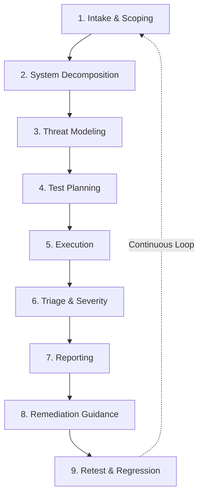

---
tags:
  - trust-boundary/deployment-governance
  - type/methodology
  - type/overview
---
# AI Red Teaming Methodology

## Overview

This methodology describes the systematic approach for assessing AI security across all engagement types. A mature AI red teaming methodology integrates rigorous planning, realistic threat simulation, and thorough evidence capture into the AI development lifecycle—not ad-hoc or one-off testing.

**AI systems fail differently than traditional software.** Vulnerabilities emerge from behavioral manipulation and interaction patterns, not deterministic code-level bugs. Exploits succeed probabilistically across non-deterministic outputs. A single successful exploit proves the vulnerability exists and must be addressed. Traditional penetration testing assumptions (binary pass/fail, network-based vectors, deterministic execution) do not apply.

**Good methodology characteristics:**
- Systematic lifecycle from intake through retest with documented phase outputs
- Blends human creativity with automated tools (automation for breadth, humans for depth)
- Tailored to attack surface (LLM apps vs RAG vs agents vs supply chain require different approaches)
- Evidence-based with statistical reproducibility thresholds
- Framework-aligned (MITRE ATLAS, OWASP LLM Top 10, NIST AI RMF) without checkbox compliance
- Continuous integration into CI/CD for regression testing

---

## The AI Red Teaming Lifecycle

Our methodology follows a 9-phase lifecycle where each phase's outputs become the next phase's inputs, creating a documented trail from risk hypotheses to validated fixes.

### Core Lifecycle Phases

1. **[[methodology/phase-1-intake-scoping|Intake & Scoping]]** - Define boundaries, objectives, and success criteria
2. **[[methodology/phase-2-system-decomposition|System Decomposition & Architecture Review]]** - Map assets, data flows, and trust boundaries
3. **[[methodology/phase-3-threat-modeling|Threat Modeling]]** - Identify attacker personas, goals, and prioritized attack scenarios
4. **[[methodology/phase-4-test-planning|Test Planning & Coverage]]** - Map threats to concrete test cases with technique playbooks
5. **[[methodology/phase-5-execution|Execution (Adversarial Testing)]]** - Active testing with evidence capture and real-time adaptation
6. **[[methodology/phase-6-triage-severity|Triage & Severity Assessment]]** - Validate findings and apply AI-specific risk scoring
7. **[[methodology/phase-7-reporting|Reporting & Communication]]** - Deliver technical findings and executive summaries with remediation roadmaps
8. **[[methodology/phase-8-remediation-guidance|Remediation Guidance]]** - Provide actionable mitigations mapped to root causes
9. **[[methodology/phase-9-retest-regression|Retest & Regression Integration]]** - Validate fixes and integrate findings into CI/CD

[[methodology/lifecycle-overview|View complete lifecycle overview]]

---

## Attack-Surface Variants

AI systems vary significantly in architecture and attack surface. The methodology adapts to five primary variants:

- **[[methodology/variant-llm-applications|LLM Applications]]** - Standalone models with prompt-based attacks
- **[[methodology/variant-rag-systems|RAG Systems]]** - Retrieval layer plus model with indirect injection risks
- **[[methodology/variant-agentic-systems|Agentic Systems]]** - Tool-wielding agents with autonomy risks
- **[[methodology/variant-supply-chain|Supply Chain]]** - Model and dependency integrity threats
- **[[methodology/variant-evaluation-pipelines|Evaluation Pipelines]]** - Securing the testing and governance infrastructure

[[methodology/attack-variants-overview|View attack variants overview]]

---

## Standards & Cross-Cutting Concerns

- **[[methodology/evidence-reproducibility|Evidence & Reproducibility]]** - Standards for handling non-determinism and statistical validation
- **[[methodology/tooling-automation|Tooling & Automation]]** - When and how to use automated vs manual techniques
- **[[methodology/framework-mapping|Framework Mapping]]** - Integration with OWASP, ATLAS, NIST AI RMF, and SAIF
- **[[methodology/common-pitfalls|Common Pitfalls]]** - Anti-patterns and mistakes to avoid
- **[[methodology/quality-assurance|Quality Assurance]]** - Peer review and validation gates

---

## Methodology Applications

### Engagement Types
- **[[methodology/methodology-variations|Methodology Variations]]** - How the lifecycle adapts across engagement types (full-spectrum, focused, continuous, purple team)
- **[[playbooks/engagements-overview|View All Engagements]]** - Specific engagement offerings with methodology application examples

### AI-Specific Challenges
- **[[methodology/handling-non-determinism|Handling Non-Determinism]]** - Statistical thresholds and consistency testing
- **[[methodology/guardrails-safety-testing|Guardrails & Safety Testing]]** - Policy enforcement and bias evaluation

---

## Related Documentation

### Trust Boundaries (Attack Taxonomy)
- [[methodology/trust-boundaries-overview|Trust Boundaries Overview]] - The four-boundary model underlying threat modeling
- [[methodology/model-issues-overview|Model Boundary Issues]] - Jailbreaks, prompt injection, training data extraction
- [[methodology/data-knowledge-issues-overview|Data/Knowledge Boundary Issues]] - RAG poisoning, embedding attacks
- [[methodology/application-agent-issues-overview|Application/Agent Boundary Issues]] - Tool misuse, goal hijacking
- [[methodology/deployment-governance-issues-overview|Deployment/Governance Issues]] - Access control, secrets exposure

### Threat Intelligence
- [[atlas/atlas-overview|MITRE ATLAS Reference]] - Adversarial threat landscape for AI systems
- [[atlas/techniques|ATLAS Techniques]] - Detailed attack technique catalog
- [[atlas/case-studies|ATLAS Case Studies]] - Real-world incident analysis
